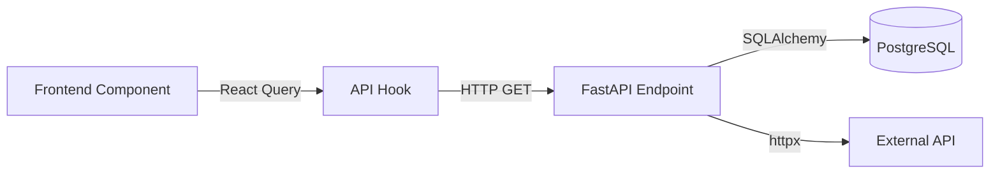

# CODE_OVERVIEW.md — [PROJECT_NAME]

This is a living architecture document. Update it at the end of each phase.
Future Claude sessions (and humans) use this to onboard quickly.

---

## Current Status

| Phase | Status | Description |
|-------|--------|-------------|
| Phase 1 | ⬜ | [description] |
| Phase 2 | ⬜ | [description] |
| Phase 3 | ⬜ | [description] |

**Current focus:** Phase 1

---

## Architecture Overview

[1-2 paragraph summary of how the system works at a high level.
What problem does it solve? What are the main moving parts?]

```
[ASCII diagram of high-level architecture if helpful]

Example:
Browser → React App → FastAPI → PostgreSQL
                    ↘ External APIs
```

---

## Project Structure

```
[project-root]/
├── backend/
│   ├── app/
│   │   ├── main.py          # [what it does]
│   │   ├── api/             # REST endpoints
│   │   ├── models/          # SQLAlchemy DB models
│   │   ├── services/        # Business logic
│   │   └── schemas/         # Pydantic request/response types
│   └── requirements.txt
│
├── frontend/
│   ├── src/
│   │   ├── App.tsx          # [what it does]
│   │   ├── components/      # React components
│   │   ├── hooks/           # React Query hooks
│   │   ├── services/api.ts  # Axios HTTP client
│   │   ├── utils/           # Shared utilities
│   │   └── types/index.ts   # All TypeScript interfaces
│   └── e2e/                 # Playwright smoke tests
│
└── scripts/                 # Dev utilities
```

---

## Data Flow

### [Feature Name] Data Flow



[Add more data flow diagrams as features are built]

---

## Key Design Decisions

| Decision | Choice | Reason |
|----------|--------|--------|
| State management | React Query | Server state with caching + auto-refetch |
| Styling | TailwindCSS | Utility-first, no CSS modules overhead |
| API client | Axios | Consistent interceptors, easy error handling |
| [Add decisions as they're made] | | |

---

## Phase Notes

### Phase 1: [Name] — ⬜ In Progress

**Goal:** [What this phase accomplishes]

**Key files:**
- `[file]` — [what it does]

**How it works:**
[Explanation of the main implementation]

**Gotchas / lessons learned:**
[Things that were tricky, edge cases, decisions made]

---

### Phase 2: [Name] — ⬜ Not Started

**Goal:** [What this phase will accomplish]

---

## Deep Dives

### [Module Name] (`path/to/file.ts`)

[Explain a complex or non-obvious part of the codebase in detail.
Include code snippets, data shapes, calculation formulas, or flow diagrams.
This is for the next developer (or future Claude) who needs to understand it fast.]

**What it does:**
[purpose]

**How it works:**
[step by step]

**Key data shape:**
```typescript
interface ExampleData {
  // ...
}
```

**Edge cases:**
[things to watch out for]

---

## Known Issues / Tech Debt

| Issue | Severity | Notes |
|-------|----------|-------|
| [issue description] | Low/Med/High | [context, workaround if any] |

---

## Onboarding Checklist

New to this codebase? Read in this order:

1. `CLAUDE.md` — Project conventions and rules
2. This file — Architecture overview
3. `frontend/src/types/index.ts` — Data shapes
4. `frontend/src/App.tsx` — Entry point, routing
5. `backend/app/main.py` — Entry point, routers
6. `PROJECT.md` — Current feature context
